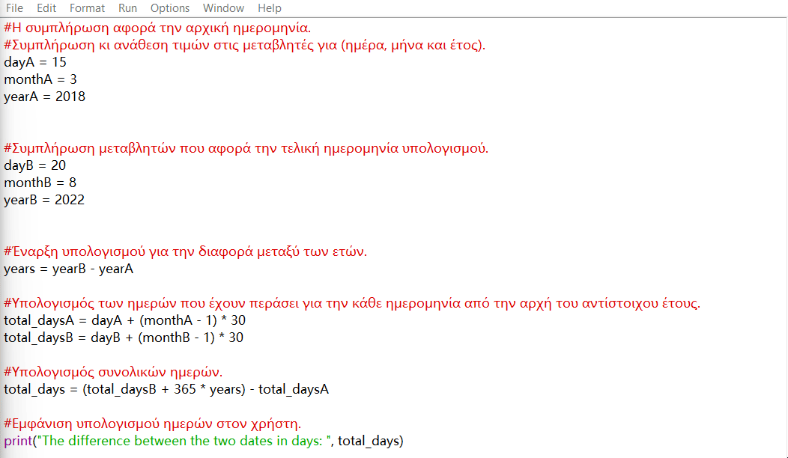

## Demo

Program Description: 

A simple program that runs in the Python programming language using Python IDLE Shell 3.13.7. It takes two dates (the start and the end) as input for day, month, and year and returns the approximate difference in days, assuming 30 days per month and 365 days per year.

How it works:

• The variables dayA, monthA, yearA are set for the starting date, and dayB, monthB, yearB for the ending date.

• The number of days from the beginning of each year is calculated using an approximation of 30 days per month.

• The difference is calculated using the years and the approximated days, and the result is printed.

Limitations and improvements:

• The current implementation uses a fixed assumption of 30 days per month and does not take into account leap years or the variable number of days in each month.

• Next steps: replace the approach with the use of the datetime library for accurate calculations, and add input validation and unit tests.

According to the above visual presentation of the program, the necessary assumptions that arise are as follows:

• We assume that each month has 30 days and that there are no leap years, meaning each year has 365 days.

• We assume that the user always enters correct values in the input variables. That is, in the initial date, for example, for the month, they enter a number from 1 (January) to 12 (December).

• We assume that the user enters an initial date that is earlier, even by just one day, than the final date.

Code explanation:
We provide the start date A and the end date B while calculating the days from New Year's Day of year A to New Year's Day of year B, that is, the 'blue' distance, while simultaneously calculating the 'green' and 'orange' distances, respectively. Finally, we calculate the final result, which we display to the user as well!
Despite the assumptions we made regarding the calculations, our program works relatively well. For example, the above execution will show that between 15/03/2018 and 20/08/2022, 1615 days have passed, while in reality the correct result is 1619 days, the discrepancy is small.
